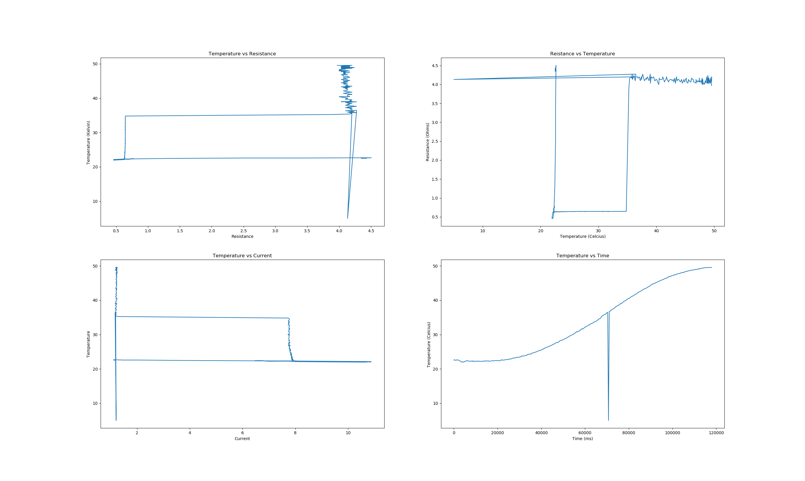
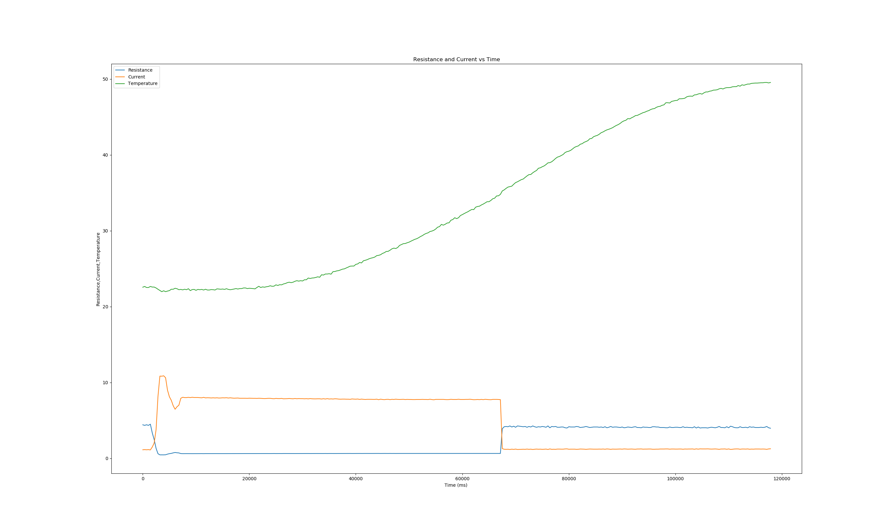
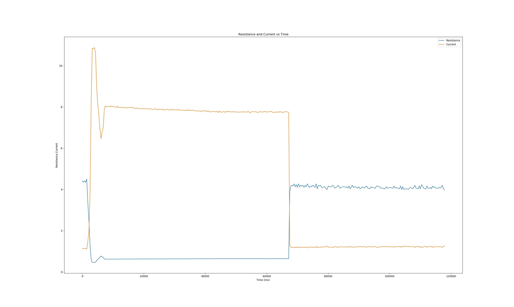

# HLA-Nichrome-Analysis
Analysis of Data obtained when testing a experimental ignition system devised by the Aries Propulsion Team. 

The goal was to test the heating curves of a nichrome wire done at small scale to give us a sense of any misconceptions we've had. The set up used a hall effect sensor as well a thermocouple to read in data to a Arduino 2560. The serial output was then convereted to a CSV using Python. Analysis was done in Python using Numpy and Matplotlib

## Graphs

## Findings
The most important finding was that the temperature continues increasing well after power has been cut to the heating element. 

We also discovered an issue that needs to be worked on in terms of measuring the Temperature as a function of Current or Resistance. 
